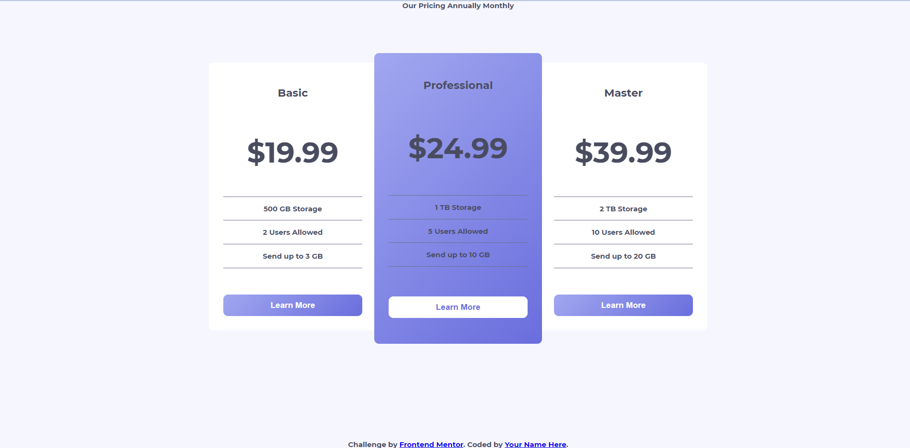

# Frontend Mentor - Pricing component with toggle solution

This is a solution to the [Pricing component with toggle challenge on Frontend Mentor](https://www.frontendmentor.io/challenges/pricing-component-with-toggle-8vPwRMIC). Frontend Mentor challenges help you improve your coding skills by building realistic projects.

## Table of contents

- [Overview](#overview)
  - [The challenge](#the-challenge)
  - [Screenshot](#screenshot)
  - [Links](#links)
- [My process](#my-process)
  - [Built with](#built-with)
  - [What I learned](#what-i-learned)

## Overview
I wanted to take a shot at using raw web components and this was my first attempt. Conclusion: I dont like them - yet.

Styling web components is trick and a pain. There isnt a clear or easily manageable way to have separate style, markup, and js files that combine together. React is essentially a way to make web components easier to manage but for some dumb reason leaves out the custom tag names (ie the whole damn point of custom components). Angular is a more fully featured wrapper for these components but comes with a ton of overhead.

I think I'll give web components another shot at a later time but for now I'm throwing in the towel.

Oh, and the particular design is a pain in the ass IMO. The colors in the style-guide do not clearly represent their elements and its just in general a difficult to look at design.
### The challenge

Users should be able to:

- View the optimal layout for the component depending on their device's screen size
- Control the toggle with both their mouse/trackpad and their keyboard

### Screenshot

As far as I got on the desktop before I threw in the towel.

### Links

- Solution URL: [Github](https://github.com/JDillon522/FrontendMentor-pricing-component)
- Live Site URL: [Github Pages](https://jdillon522.github.io/FrontendMentor-pricing-component/)

## My process
I started with just experimenting with web components and trying to come up with a manageable way to work with them. I hate mixing concerns by having styles, markup, and JS in a single file. I didnt really come up with a good way to manage it all.
### Built with

- Semantic HTML5 markup
- CSS custom properties
- Flexbox
- Web Components

### What I learned

Web components have a good ways to go before I'm convinced to use them professionally. There needs to be a clear and built in way to load external html and css files to render.
